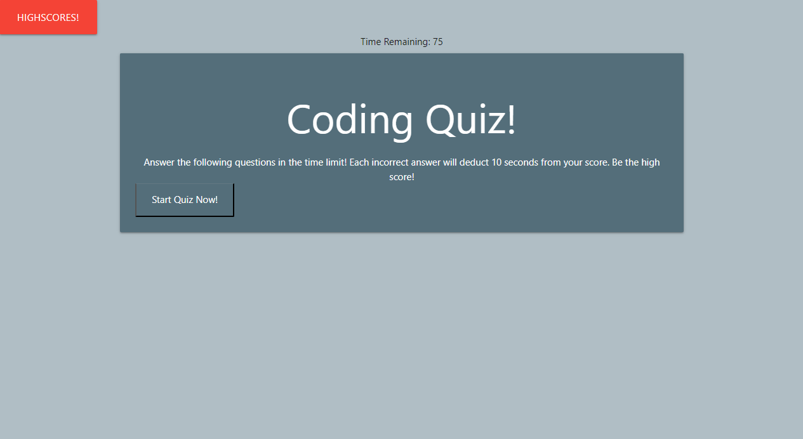

# Code-Quiz

A quiz about coding that is timed and records high scores.

## Navigation
- [User-Story](#user-story)
- [Description](#description)
- [Author](#author)

## User-Story

AS A coding boot camp student
I WANT to take a timed quiz on JavaScript fundamentals that stores high scores
SO THAT I can gauge my progress compared to my peers

## Description

Upon loading, the user is presented with access to the locally stored Highscores, or a chance to begin the quiz themselves. The user has 75 seconds to complete the quiz, while each incorrect answer deducts 10 seconds from the remaining time. The quiz is over when either the time left hits 0, or the user correctly answers all five questions.

Once a user has completed the quiz, they will have a chance to leave their mark on history by submitting three initials to represent their performance, which will be stored in local storage until either a new challenger arises, or someone simple wants to clear the stored data.

This quiz was styled completely with Materialize.

## Author

Gregory Quinn Roth - https://github.com/rothgq